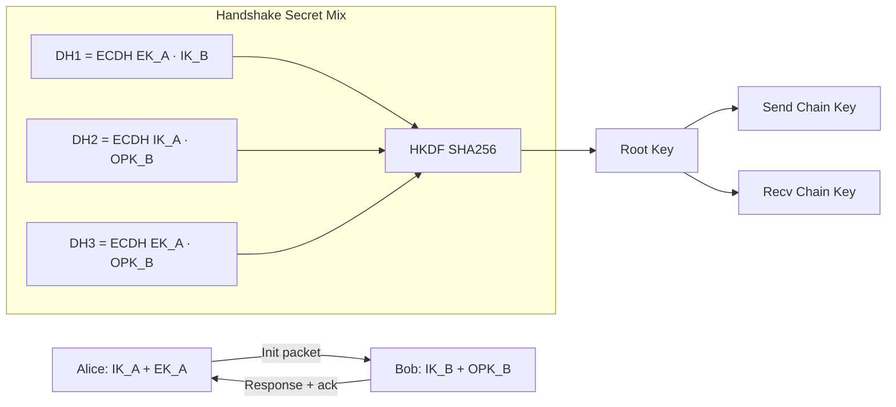
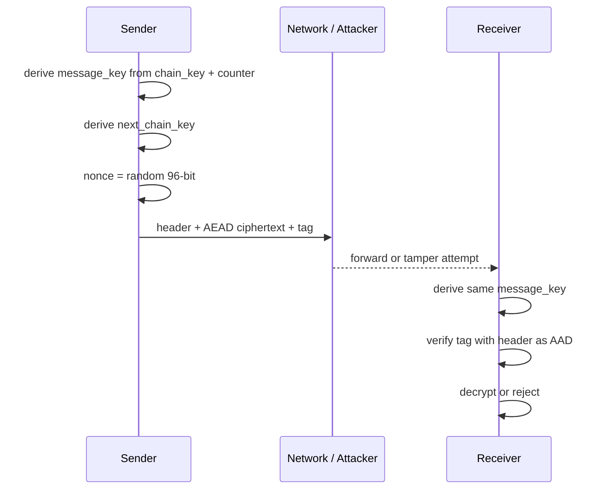
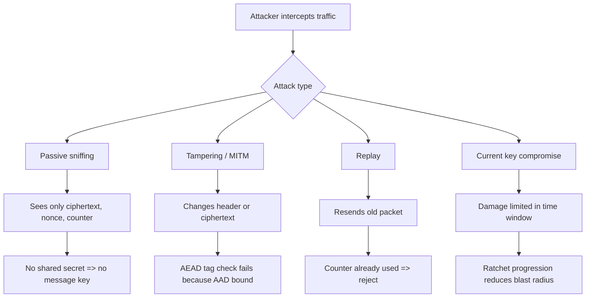

# 🔐 Mesh-ERL Protocol — Aegis Ratchet v1

<div align="center">


</div>

> ⚠️ **Важно:** это инженерный прототип. Он сильно усложняет стандартные атаки перехвата и подмены, но «абсолютно невзламываемых» протоколов не бывает.

---

## 🚀 Что здесь «революционного»

`Aegis Ratchet v1` сочетает в себе несколько защитных слоев сразу:

1. **Triple-DH рукопожатие (X25519)** — смешивание нескольких ECDH секретов.
2. **HKDF-SHA256** — стабильный вывод root/chain ключей.
3. **Message Key на каждый пакет** — отдельный ключ для каждого сообщения.
4. **AES-256-GCM (AEAD)** — шифрование + контроль целостности.
5. **AAD-привязка заголовка** — попытка изменить метаданные ломает верификацию.
6. **Ratchet-прогрессия** — компрометация «сейчас» не раскрывает всё «потом/раньше».

---

## 🧠 Архитектура протокола

> Ниже схема переписана в GitHub-compatible Mermaid синтаксисе (без проблемных токенов).



---

## 📨 Поток одного сообщения



---

## 🛡️ Во что «упирается» атака



---

## ⚙️ Практическая реализация

- Протокол: `src/mesh_aegis.erl`
- Демо: `src/mesh_demo.erl`

### Реализовано

- Генерация identity и ephemeral ключей на `X25519`.
- Triple-DH handshake + HKDF key schedule.
- Отдельные send/recv chain keys.
- AEAD шифрование `AES-256-GCM`.
- Replay защита через монотонный counter.
- Аутентификация заголовка через AAD.

---

## ▶️ Быстрый запуск

```bash
erlc -o ebin src/mesh_aegis.erl src/mesh_demo.erl
erl -pa ebin -noshell -s mesh_demo run -s init stop
```

Ожидаемо в выводе:

- `Handshake complete.`
- `Tampering attack blocked ...`
- `Replay attack blocked.`
- Успешная двусторонняя расшифровка сообщений.

---

## 🔬 Криптографический стек

- **ECDH:** X25519
- **KDF:** HKDF-SHA256
- **AEAD:** AES-256-GCM
- **Ratchet progression:** HMAC-SHA256

---

## ⚠️ Ограничения прототипа

- Нет production-grade identity verification (подписи/pinning).
- Нет полного механизма хранения пропущенных message keys (как в полном Double Ratchet).
- Нет formal verification и внешнего аудита.

---

## ✅ Что добавить до production

1. Ed25519 подписи identity-ключей + pinning/TOFU.
2. Hybrid secret mix (например, + post-quantum KEM).
3. Session lifecycle: expiration, rekey, revocation.
4. Внешний security audit + threat-model review.

