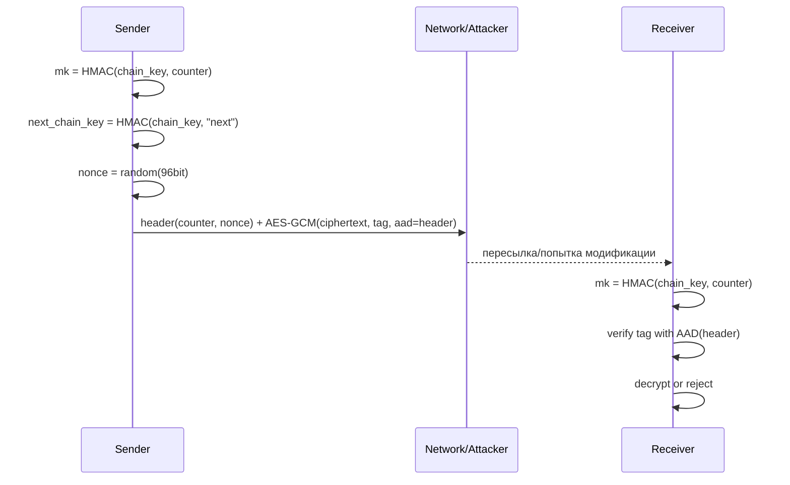
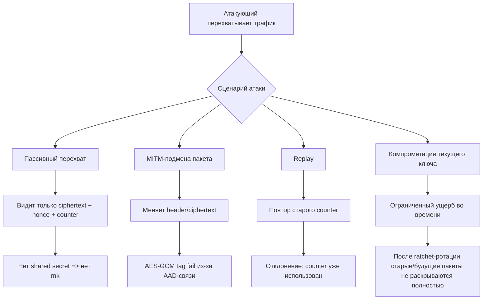

# Mesh-ERL Protocol: **Aegis Ratchet v1**

<div align="center">


</div>

> ⚠️ Важный дисклеймер: протокол ниже — учебно-инженерный прототип. Он **существенно усложняет перехват и дешифровку** обычными атаками (MITM без ключей, пассивный sniffing, replay), но никакой протокол не дает «абсолютной невозможности» взлома.

---

## Идея «революционности»

`Aegis Ratchet v1` комбинирует:

1. **Тройной ECDH на X25519** (аналог X3DH-подхода) на рукопожатии.
2. **HKDF-SHA256** для вывода root key и chain keys.
3. **Message key per packet**: каждый пакет шифруется одноразовым ключом из ratchet-цепочки.
4. **AES-256-GCM** (AEAD) с отдельным nonce на каждый пакет.
5. **Криптографически связанный заголовок (AAD)** для защиты от подмены маршрутизации/метаданных.
6. **Пост-компромиссное восстановление**: после смены ratchet-ветки старые ключи быстро устаревают.

---

## Архитектура протокола

```mermaid
flowchart LR
    A[Alice: IK_A + EK_A] -->|Init Packet| B[Bob: IK_B + OPK_B]
    B -->|Response + Ack| A

    subgraph Handshake Secret Mix
      D1[DH1 = ECDH(EK_A, IK_B)]
      D2[DH2 = ECDH(IK_A, OPK_B)]
      D3[DH3 = ECDH(EK_A, OPK_B)]
      KDF[HKDF-SHA256]
      D1 --> KDF
      D2 --> KDF
      D3 --> KDF
    end

    KDF --> RK[Root Key]
    RK --> CKs[Send Chain Key]
    RK --> CKr[Recv Chain Key]
```

---

## Поток сообщения (одно сообщение)



---

## Где «упирается» атака



---

## Практическая реализация

Реализация находится в `src/mesh_aegis.erl` и демонстрация в `src/mesh_demo.erl`.

### Что уже реализовано

- Генерация long-term identity ключей (`IK`) и ephemeral ключей (`EK`, `OPK`) на `X25519`.
- Handshake с тройным ECDH и KDF.
- Двусторонние send/recv chain keys.
- Шифрование/дешифровка сообщений через AES-256-GCM.
- Проверка replay (монотонный счетчик).
- Верификация целостности через GCM tag + AAD.

---

## Быстрый запуск

```bash
erlc -o ebin src/mesh_aegis.erl src/mesh_demo.erl
erl -pa ebin -noshell -s mesh_demo run -s init stop
```

Ожидаемый результат:
- успешный handshake,
- обмен зашифрованными сообщениями,
- демонстрация провала tampering/replay атаки.

---

## Криптографический состав

- **ECDH**: X25519
- **KDF**: HKDF-SHA256 (extract+expand)
- **AEAD**: AES-256-GCM
- **Key progression**: HMAC-SHA256 ratchet chain

---

## Ограничения прототипа

- Нет PKI/подписей и pinning identity в production-формате.
- Нет полноценного asynchronous skip-message key store (как в полном Double Ratchet).
- Нет formal verification.

---

## Рекомендации для production

1. Добавить подписи identity-ключей (Ed25519) и trust-on-first-use/pinning.
2. Добавить post-quantum KEM (например, Kyber) в secret mix.
3. Реализовать управление сессиями, ротацию и expiration ключей.
4. Провести внешний security audit.

